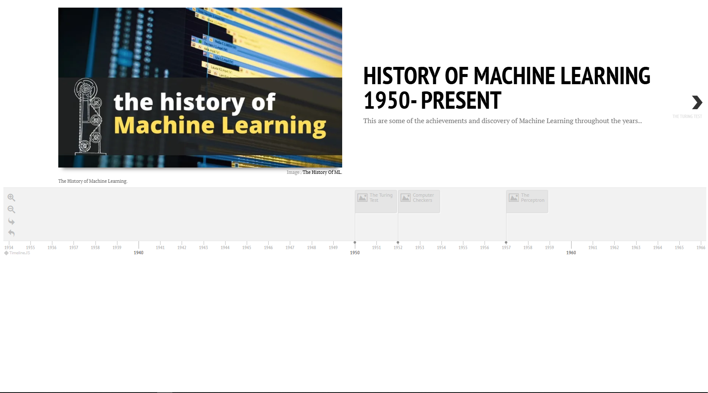

## Timeline Builder

Use Timeline.js to build a timeline! With thanks to the Knight Lab at [NorthWestern University](https://timeline.knightlab.com/).

While you can use a spreadsheet to build your timeline as per the docs, here's a sample of how to build your timeline using JSON.

Run this website locally:

1. Make sure you have Node.js installed.
2. Fork this repo and place it on your local machine in a folder.
3. Using the command line, CD (change directory) to the folder: `cd myTimeline`.
4. Use `http-server` to quickly start up a local server; from your code's folder run `npx http-server`. You should see a timeline of Whitney Houston's amazing and tragic life.

Build your own JSON structures for a new timeline, [following the docs](https://timeline.knightlab.com/docs/json-format.html).

View this example [timeline](https://digital-humanities-toolkit.github.io/timeline-builder/)

References:

Applied AI Course blog — History of Machine Learning
Saxena, A. (2024, October 22). The history of machine learning. Applied AI Course Blog. Retrieved August 22, 2025, from https://www.appliedaicourse.com/blog/history-of-machine-learning/

‌Wikipedia — 
Timeline of machine learning. (n.d.). In Wikipedia. Retrieved August 22, 2025, from https://en.wikipedia.org/wiki/Timeline_of_machine_learning

Wikipedia — 
Deep Blue (chess computer). (n.d.). In Wikipedia. Retrieved August 22, 2025, from https://en.wikipedia.org/wiki/Deep_Blue_(chess_computer)

Wikipedia — 
Nearest neighbour algorithm. (n.d.). In Wikipedia. Retrieved August 22, 2025, from https://en.wikipedia.org/wiki/Nearest_neighbour_algorithm

